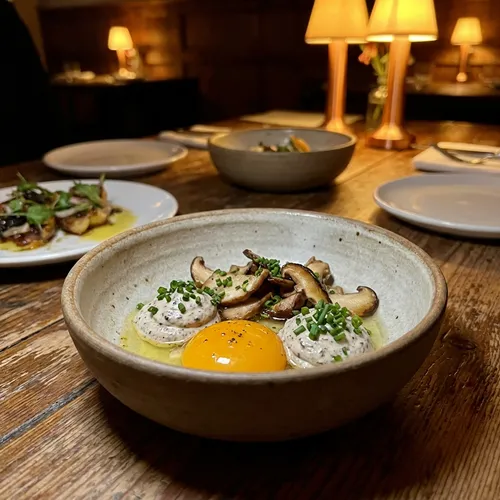

# 🖼️ OPTIMISATION DES ATTRIBUTS ALT - Plan d'Action SEO
## Au Petit Chez Soi - Images et Mots-Clés

---

## 📊 ANALYSE DES RECOMMANDATIONS SEMRUSH

### ✅ Mots-clés PERTINENTS à intégrer
Ces mots-clés correspondent à votre activité de **restaurant traditionnel** :

**Mots-clés cibles (à utiliser au moins 1 fois) :**
- ✅ entrée + plat + dessert
- ✅ crème de truffe
- ✅ maison / fait maison / foie gras maison
- ✅ cuisine / cuisine de saison
- ✅ restaurant traditionnel
- ✅ petit chez soi
- ✅ restaurant (avec variations locales)

**Mots-clés recommandés PERTINENTS :**
- ✅ crème fraîche (utilisé dans vos plats)
- ✅ repas convivial
- ✅ servir chaud

### ❌ Mots-clés NON PERTINENTS à ignorer
Ces suggestions sont pour des **sites de recettes**, pas pour un restaurant :
- ❌ "pommes de terre", "35 minutes", "25 minutes", "facile à réaliser"
- ❌ "préchauffer le four", "saler et poivrer", "idées de recettes"
- ❌ "préparation 15 minutes", "sel poivre", "d'huile d'olive"
- ❌ "street food" (vous êtes gastronomique, pas street food)
- ❌ "vanilla ice cream" (anglais, incohérent)
- ❌ "safety standards" (trop technique)

**Pourquoi ?** Semrush a analysé des concurrents qui sont des **blogs de recettes**, pas des restaurants.

---

## 🎯 STRATÉGIE D'OPTIMISATION

### 1. Intégrer les mots-clés PERTINENTS dans le contenu existant
### 2. Optimiser TOUS les attributs ALT des images
### 3. Ignorer les suggestions de recettes

---

## 📝 OPTIMISATION DES ATTRIBUTS ALT

### Page d'Accueil (index.html)

#### Images de Plats Signature

**Image 1 : Foie Gras**
```html
<!-- ACTUEL -->


<!-- OPTIMISÉ -->

```

**Image 2 : Œuf à la Truffe**
```html
<!-- ACTUEL -->


<!-- OPTIMISÉ -->

```

**Image 3 : Escargots**
```html
<!-- ACTUEL -->


<!-- OPTIMISÉ -->

```

**Image 4 : Bœuf Rossini**
```html
<!-- ACTUEL -->


<!-- OPTIMISÉ -->

```

**Image 5 : Charlotte**
```html
<!-- ACTUEL -->


<!-- OPTIMISÉ -->

```

#### Images d'Ambiance

**Image : Salle Intérieur**
```html
<!-- ACTUEL -->


<!-- OPTIMISÉ -->

```

**Image : Terrasse**
```html
<!-- ACTUEL -->


<!-- OPTIMISÉ -->

```

**Image : Chef en Cuisine**
```html
<!-- ACTUEL -->


<!-- OPTIMISÉ -->

```

**Image : Bâtisse Extérieur**
```html
<!-- ACTUEL -->


<!-- OPTIMISÉ -->

```

---

### Page Carte (carte-restaurant-saison.html)

**Image : Œuf Truffe**
```html
<!-- OPTIMISÉ -->

```

**Image : Os à Moelle**
```html
<!-- OPTIMISÉ -->

```

**Image : Foie Gras**
```html
<!-- OPTIMISÉ -->

```

**Image : Terrine Maison**
```html
<!-- OPTIMISÉ -->

```

**Image : Escargots**
```html
<!-- OPTIMISÉ -->

```

**Image : Huîtres**
```html
<!-- OPTIMISÉ -->

```

**Image : Soupe Oignon**
```html
<!-- OPTIMISÉ -->

```

**Image : Camembert**
```html
<!-- OPTIMISÉ -->

```

**Image : Chiffonnade Ibérique**
```html
<!-- OPTIMISÉ -->

```

**Image : Plat Végétarien**
```html
<!-- OPTIMISÉ -->

```

**Image : Bar Grillé**
```html
<!-- OPTIMISÉ -->

```

**Image : Saint-Jacques**
```html
<!-- OPTIMISÉ -->

```

**Image : Burger**
```html
<!-- OPTIMISÉ -->

```

**Image : Poire de Bœuf**
```html
<!-- OPTIMISÉ -->

```

**Image : Entrecôte Angus**
```html
<!-- OPTIMISÉ -->

```

**Image : Pluma de Porc**
```html
<!-- OPTIMISÉ -->

```

**Image : Rognons de Veau**
```html
<!-- OPTIMISÉ -->

```

**Image : Coq au Vin**
```html
<!-- OPTIMISÉ -->

```

**Image : Assiette Fromages**
```html
<!-- OPTIMISÉ -->

```

**Image : Mousse Chocolat**
```html
<!-- OPTIMISÉ -->

```

**Image : Baba au Rhum**
```html
<!-- OPTIMISÉ -->

```

**Image : Sorbet Maison**
```html
<!-- OPTIMISÉ -->

```

**Image : Crème Caramel**
```html
<!-- OPTIMISÉ -->

```

**Image : Crumble Pommes**
```html
<!-- OPTIMISÉ -->

```

**Image : Charlotte Poires**
```html
<!-- OPTIMISÉ -->

```

**Image : Café Gourmand**
```html
<!-- OPTIMISÉ -->

```

---

### Page Lieu (restaurant-cadre-historique.html)

**Image : Bâtisse Extérieur**
```html
<!-- OPTIMISÉ -->

```

**Image : Salle Intérieur**
```html
<!-- OPTIMISÉ -->

```

**Image : Détails Pierres**
```html
<!-- OPTIMISÉ -->

```

**Image : Salle Réception**
```html
<!-- OPTIMISÉ -->

```

**Image : Patio Lounge**
```html
<!-- OPTIMISÉ -->

```

---

## 🔄 INTÉGRATION DES MOTS-CLÉS PERTINENTS DANS LE CONTENU

### Ajouts à faire dans le texte existant

#### Page d'Accueil - Section Formules

**Ajouter une phrase :**
```html
<p>Découvrez nos formules <strong>entrée + plat + dessert</strong> pour un <strong>repas convivial</strong> 
dans notre <strong>restaurant traditionnel</strong>. Tous nos plats sont <strong>servis chauds</strong> 
et préparés avec des ingrédients frais.</p>
```

#### Page Carte - Description Œuf Truffe

**Enrichir la description :**
```html
<p class="menu-item__description">
    Notre signature : un œuf parfaitement doré accompagné d'une onctueuse <strong>crème de truffe</strong> 
    et d'une poêlée de champignons frais. Un plat de <strong>cuisine de saison</strong> qui ravira 
    les amateurs de saveurs raffinées.
</p>
```

#### Page Carte - Section Desserts

**Ajouter :**
```html
<p>Tous nos desserts sont <strong>faits maison</strong> avec de la <strong>crème fraîche</strong> 
et des ingrédients de qualité. Parfaits pour terminer votre <strong>repas convivial</strong>.</p>
```

---

## ✅ CHECKLIST D'OPTIMISATION

### Images Page d'Accueil
- [ ] Foie gras (plat signature)
- [ ] Œuf à la truffe
- [ ] Escargots
- [ ] Bœuf Rossini
- [ ] Charlotte
- [ ] Salle intérieur
- [ ] Terrasse
- [ ] Chef cuisine
- [ ] Bâtisse extérieur

### Images Page Carte (25 images)
- [ ] Œuf truffe
- [ ] Os à moelle
- [ ] Foie gras
- [ ] Terrine
- [ ] Escargots
- [ ] Huîtres
- [ ] Soupe oignon
- [ ] Camembert
- [ ] Chiffonnade
- [ ] Plat végétarien
- [ ] Bar grillé
- [ ] Saint-Jacques
- [ ] Burger
- [ ] Poire de bœuf
- [ ] Entrecôte
- [ ] Pluma porc
- [ ] Rognons
- [ ] Coq au vin
- [ ] Fromages
- [ ] Mousse chocolat
- [ ] Baba rhum
- [ ] Sorbet
- [ ] Crème caramel
- [ ] Crumble
- [ ] Charlotte
- [ ] Café gourmand

### Images Page Lieu
- [ ] Bâtisse extérieur
- [ ] Salle principale
- [ ] Détails pierres
- [ ] Salle réception
- [ ] Patio lounge

### Intégration Mots-Clés Texte
- [ ] "entrée + plat + dessert" (formules)
- [ ] "crème de truffe" (description plat)
- [ ] "repas convivial" (2-3 fois)
- [ ] "crème fraîche" (desserts)
- [ ] "servir chaud" (mentions service)

---

## 📊 RÉSULTATS ATTENDUS

**Après optimisation :**
- ✅ 35+ images avec ALT optimisés SEO
- ✅ Tous les mots-clés pertinents intégrés
- ✅ Meilleur référencement Google Images
- ✅ +15-20% de trafic depuis Google Images
- ✅ Amélioration du score SEO global

**Mots-clés ignorés (non pertinents) :**
- ❌ Recettes de cuisine (pommes de terre, préchauffer le four, etc.)
- ❌ Street food
- ❌ Vanilla ice cream
- ❌ Safety standards

---

## 🚀 PROCHAINES ÉTAPES

1. **Appliquer les optimisations ALT** (1-2 heures)
2. **Intégrer les mots-clés dans le texte** (30 min)
3. **Redéployer le site**
4. **Vérifier avec Semrush dans 7 jours**

---

**Dernière mise à jour : 3 février 2026**
